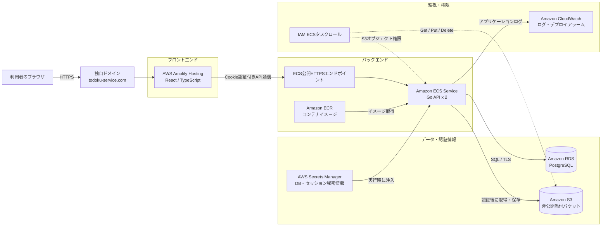
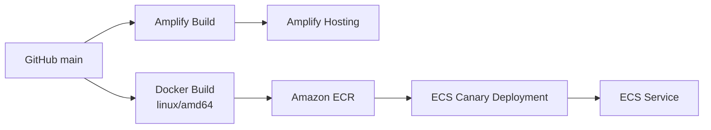

# AWS構成

Todokuの本番環境は、フロントエンドをAWS Amplify Hosting、APIをAmazon ECS、データベースをAmazon RDS for PostgreSQL、添付ファイルをAmazon S3で提供しています。

## セキュリティ上の境界

- APIはセッションCookieで利用者を認証し、Roleと所属情報に基づいて操作・閲覧を制御します。
- RDS接続にはTLSを使用し、認証情報とセッション秘密情報はSecrets ManagerからECSへ渡します。
- S3はパブリックアクセスを全面的に遮断しています。ブラウザからS3へ直接アクセスさせず、APIで認証・閲覧権限を確認してから配信します。
- ECSタスクロールは添付オブジェクトの取得・保存・削除に限定しています。
- ECSは2タスクで稼働し、CloudWatchアラームとサーキットブレーカーを伴うカナリアデプロイを使用します。

## デプロイ経路

添付ファイル用S3バケットとECSタスクロールは、[`deploy/aws/attachment-storage.yml`](../../deploy/aws/attachment-storage.yml)でCloudFormation管理しています。ECS、RDS、Amplifyを含む全環境のIaC化は今後の改善項目です。
