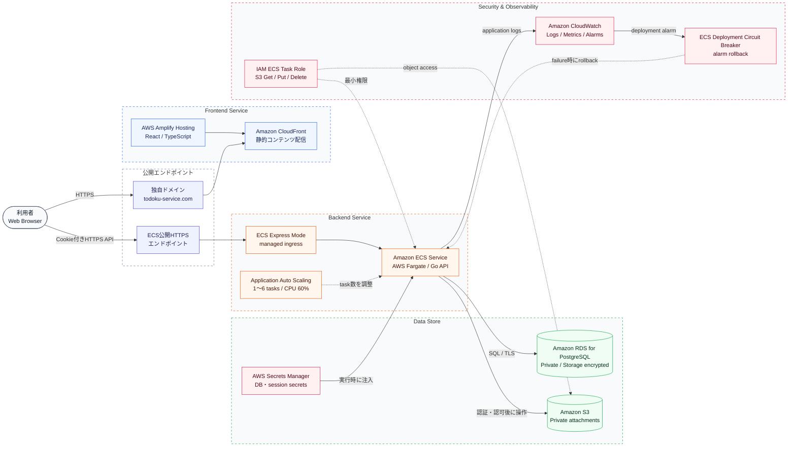

# AWS構成・デプロイ経路

Todokuの本番環境は、フロントエンドをAWS Amplify Hosting、Go APIをAmazon ECS on AWS Fargate、データベースをAmazon RDS for PostgreSQL、添付ファイルをAmazon S3で提供しています。図は2026年9月5日にAWS上の稼働設定と照合しています。

## AWS構成図

### 実行時の通信経路

1. ブラウザは`https://todoku-service.com`からAmplify Hosting上のReactアプリを取得します。
2. ReactアプリはECSの公開HTTPSエンドポイントへCookie付きでAPIリクエストを送ります。
3. ECS上のGo APIがセッション、Role、所属、公開範囲を確認します。
4. APIはRDSへSQLを実行し、添付は認可後に非公開S3へ保存・取得します。
5. アプリケーションログとCPUなどのメトリクスはCloudWatchへ送られます。

> 現在、FrontendとAPIは別オリジンです。Safariを含むブラウザのCookie互換性とCSRF耐性を改善するため、将来は`todoku-service.com/api/*`へ統合する方針です。

## デプロイ経路

```mermaid
flowchart LR
    subgraph source[Source]
        developer[Developer]
        frontRepo[GitHub<br/>Frontend main]
        backRepo[GitHub<br/>Backend main]
        developer --> frontRepo
        developer --> backRepo
    end

    subgraph frontPipeline[Frontend - Automatic]
        direction LR
        webhook[Amplify webhook]
        frontBuild[Amplify Build<br/>npm install / build]
        frontDeploy[Amplify Hosting<br/>CloudFront配信]
        webhook --> frontBuild --> frontDeploy
    end

    subgraph backPipeline[Backend - AWS CLI]
        direction LR
        docker[Docker Build<br/>linux/amd64]
        ecr[Amazon ECR<br/>commit tag]
        taskDefinition[ECS Task Definition<br/>new revision]
        canary[ECS Canary Deployment<br/>5% → 100% / bake 3 min]
        docker --> ecr --> taskDefinition --> canary
    end

    subgraph service[Production Service]
        direction TB
        frontendProd[React Frontend]
        backendProd[Fargate Tasks<br/>Auto Scaling 1〜6]
        alarm[CloudWatch Alarm]
        alarm -. 異常時 .-> backendProd
    end

    subgraph infra[Infrastructure]
        template[CloudFormation<br/>attachment-storage.yml]
        infraResources[S3 Bucket + IAM Task Role]
        template --> infraResources
    end

    frontRepo -->|main pushで自動開始| webhook
    backRepo -->|checkout| docker
    canary -->|成功時に昇格| backendProd
    canary -. alarm / circuit breaker .-> alarm
    frontDeploy --> frontendProd
    developer -->|aws cloudformation deploy| template

    classDef sourceNode fill:#eef2ff,stroke:#4f46e5,color:#1e1b4b;
    classDef buildNode fill:#eff6ff,stroke:#2563eb,color:#172554;
    classDef awsNode fill:#fff7ed,stroke:#ea580c,color:#431407;
    classDef prodNode fill:#f0fdf4,stroke:#16a34a,color:#052e16;
    classDef infraNode fill:#fff1f2,stroke:#e11d48,color:#4c0519;
    class developer,frontRepo,backRepo sourceNode;
    class webhook,frontBuild,frontDeploy buildNode;
    class docker,ecr,taskDefinition,canary awsNode;
    class frontendProd,backendProd,alarm prodNode;
    class template,infraResources infraNode;
    style source fill:#ffffff,stroke:#4f46e5,stroke-dasharray:5 5
    style frontPipeline fill:#ffffff,stroke:#2563eb,stroke-dasharray:5 5
    style backPipeline fill:#ffffff,stroke:#ea580c,stroke-dasharray:5 5
    style service fill:#ffffff,stroke:#16a34a,stroke-dasharray:5 5
    style infra fill:#ffffff,stroke:#e11d48,stroke-dasharray:5 5
```

| 対象 | 起点 | ビルド・配布 | 反映方式 |
| --- | --- | --- | --- |
| Frontend | GitHub `main`へのpush | Amplifyが依存関係を取得してVite build | Amplify Hostingへ自動反映 |
| Backend | GitHub `main`のcommit | `linux/amd64`のDocker imageをbuildしてECRへpush | 新しいTask Definition revisionをECSへ反映 |
| 添付基盤 | `deploy/aws/attachment-storage.yml` | AWS CloudFormation | S3とIAM Task Roleを更新 |

BackendはCodePipeline・CodeDeployによるBlue/Green構成ではありません。ECSネイティブのカナリア方式で新revisionの5%を先に稼働させ、3分間のbake後に全体へ昇格します。CloudWatch AlarmまたはDeployment Circuit Breakerが異常を検知した場合は自動ロールバックします。

添付ファイル用S3バケットとECSタスクロールは、[`deploy/aws/attachment-storage.yml`](../../deploy/aws/attachment-storage.yml)でCloudFormation管理しています。ECS、RDS、Amplifyを含む全環境のIaC化とBackendデプロイのCI/CD化は今後の改善項目です。

## セキュリティ上の境界

- APIはセッションCookieで利用者を認証し、Roleと所属情報に基づいて操作・閲覧を制御します。
- RDSはパブリックアクセスを無効化し、ストレージ暗号化と7日間のバックアップを設定しています。
- DB認証情報とセッション秘密情報はSecrets ManagerからECSへ渡します。
- S3はパブリックアクセスを全面的に遮断しています。ブラウザから直接アクセスさせず、APIで認証・閲覧権限を確認してから配信します。
- ECSタスクロールは添付オブジェクトの取得・保存・削除に限定しています。
- ECSはCPU使用率60%を目標に1〜6タスクへAuto Scalingします。
