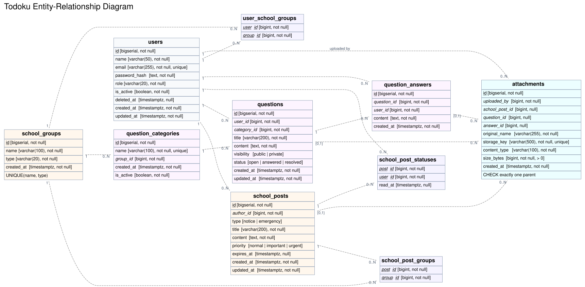

# Todoku ER図

Todokuの現行データモデルです。学校連絡、質問・回答、所属グループ、既読状態、添付ファイルの関係を示します。



- [PDF版](./todoku-erd.pdf)
- [編集可能なERソース](./todoku.er)

## 記号

- `*`: 主キー
- `+`: 外部キー
- `1`: 必ず1件
- `?`: 0件または1件
- 関係線の `*`: 0件以上

`attachments` は `school_posts`、`questions`、`question_answers` のいずれか1つだけを親に持ちます。この制約は `attachments_one_parent` のチェック制約でも保証しています。

## 再生成

Dockerが利用できる環境で、リポジトリのルートから実行します。

```bash
./scripts/generate-erd.sh
```

このスクリプトは [BurntSushi/erd](https://github.com/BurntSushi/erd) の公式コンテナを使用し、SVG版とPDF版を同じソースから生成します。

## 更新ルール

データベースのマイグレーションを追加または変更した場合は、`todoku.er` を更新し、生成物を再生成してください。レビューではソースと生成物を同じコミットに含めます。
